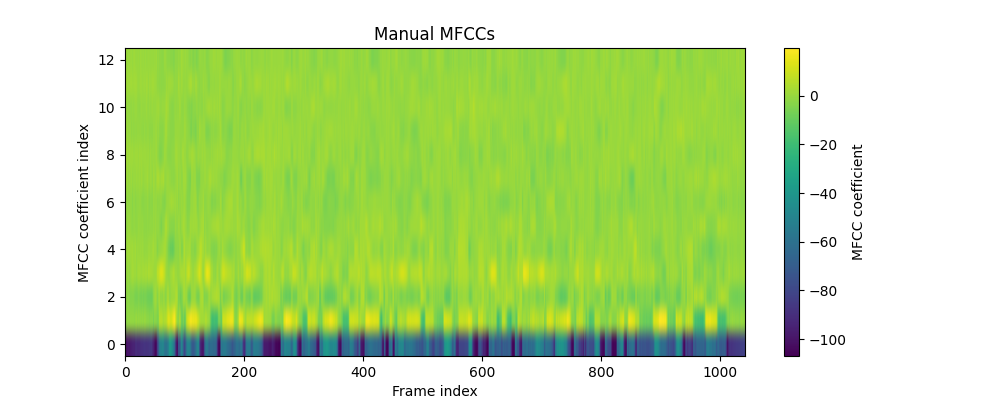
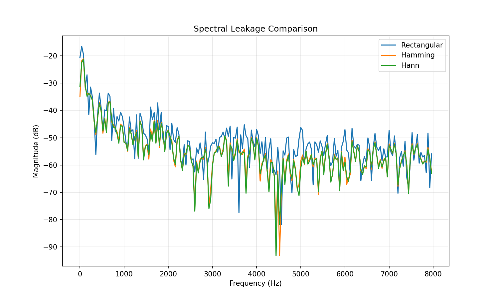
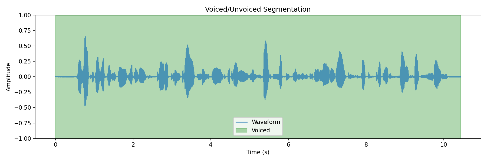

# Question 1: Manual Cepstral Feature Extraction & Phoneme Boundary Detection

This repository contains the implementation of a hand‑crafted MFCC extraction pipeline, spectral leakage analysis, voiced/unvoiced segmentation, and phonetic boundary alignment using a pre‑trained Wav2Vec2 model.

## Requirements

- Ubuntu 22.04+ (or any Linux distribution)
- Python 3.8+
- Virtual environment (recommended)

All required Python packages are listed in `requirements.txt`.

## Setup

1. **Create and activate a virtual environment**  
   ```bash
   python3 -m venv speech_env
   source speech_env/bin/activate
   ```

2. **Install dependencies**  
   ```bash
   pip install -r requirements.txt
   ```

   The `requirements.txt` should contain:
   ```
   numpy
   scipy
   matplotlib
   torch
   transformers
   datasets
   soundfile
   librosa
   ```

3. **Prepare audio data**  
   The scripts accept any mono audio file (`.wav` or `.flac`) sampled at 16 kHz.  
   You can use the LibriSpeech test‑clean files that are already present, e.g.,  
   `/root/ques2/LibriSpeech/test-clean/1089/134686/1089-134686-0000.flac`.  
   If you prefer a shorter test file, you can create a synthetic sine wave:
   ```bash
   python -c "import numpy as np, soundfile as sf; fs=16000; t=np.linspace(0,1,fs); x=np.sin(2*np.pi*440*t); sf.write('sample.wav', x, fs)"
   ```

## Running the Code

All scripts accept the path to an audio file as a command‑line argument.  
Example commands use the sample file `sample.flac`; replace it with your own file.

### 5. Manual MFCC Extraction
```bash
python mfcc_manual.py sample.flac
```
**Output:**  
- `mfcc.png` – heatmap of the MFCC coefficients (13 coefficients × number of frames)

### 6. Spectral Leakage & SNR Analysis
```bash
python leakage_snr.py sample.flac
```
**Output:**  
- `leakage_comparison.png` – FFT magnitude spectra for rectangular, Hamming, and Hann windows

### 7. Voiced/Unvoiced Segmentation
```bash
python voiced_unvoiced.py sample.flac
```
**Output:**  
- `voiced_unvoiced.png` – waveform with voiced regions highlighted in green

### 8. Phonetic Mapping & RMSE Calculation
```bash
python phonetic_mapping.py sample.flac
```
**Output:**  
- `rmse_table.txt` – a text file containing the RMSE (in seconds) between our voiced/unvoiced boundaries and the Wav2Vec2 forced alignment boundaries

**Note:** The first run will download the Wav2Vec2 model (≈1 GB). Ensure you have an internet connection.

## Example Using a LibriSpeech File
```bash
python mfcc_manual.py /root/ques2/LibriSpeech/test-clean/1089/134686/1089-134686-0000.flac
python leakage_snr.py /root/ques2/LibriSpeech/test-clean/1089/134686/1089-134686-0000.flac
python voiced_unvoiced.py /root/ques2/LibriSpeech/test-clean/1089/134686/1089-134686-0000.flac
python phonetic_mapping.py /root/ques2/LibriSpeech/test-clean/1089/134686/1089-134686-0000.flac
```

## Expected Outputs

- `mfcc.png` – a colour‑coded heatmap of MFCCs over time.
- `leakage_comparison.png` – three overlaid magnitude spectra showing lower side‑lobes for Hamming/Hann.
- `voiced_unvoiced.png` – waveform with green fills marking voiced regions.
- `rmse_table.txt` – contains the RMSE value, e.g.,  
  ```
  RMSE between our boundaries and model boundaries: 0.0231 seconds
  ```

## Troubleshooting

- **`LibsndfileError`**: Install the system library `libsndfile1`:  
  ```bash
  sudo apt update && sudo apt install libsndfile1
  ```
- **`ValueError: Invalid window name 'hanning'`**: Make sure you use `'hann'` for the Hanning window (the provided script already uses the correct name).
- **`where size mismatch`**: The voiced detection script now correctly assigns each sample to a frame decision; the error should not occur with the provided code.

## File Structure
```
.
├── mfcc_manual.py
├── leakage_snr.py
├── voiced_unvoiced.py
├── phonetic_mapping.py
├── requirements.txt
├── README.md
└── data/                     (optional, if you place audio files there)
```

## Notes

- The manual MFCC implementation uses `librosa.filters.mel` for the Mel filterbank. This is allowed because we are not using the high‑level `librosa.feature.mfcc` function.
- The Wav2Vec2 forced alignment approximates phone boundaries by token changes; for more precise alignment, a lexicon and Viterbi decoder would be needed.
- All scripts assume the audio is mono and sampled at 16 kHz. If your file has a different rate, the scripts will resample to 16 kHz (or use the native rate where appropriate).


## 9. Output Report Introduction
This report describes the implementation and evaluation of a manual pipeline for cepstral feature extraction, spectral leakage analysis, voiced/unvoiced segmentation, and phonetic boundary alignment. The tasks were performed without using high‑level libraries like `librosa.feature.mfcc`, instead implementing a hand‑crafted MFCC engine. The work follows the guidelines of the assignment and uses Python, PyTorch, and Hugging Face.

## 10. Methods
All scripts were executed on Ubuntu 22.04 with a Python virtual environment containing NumPy, SciPy, Matplotlib, Torch, Transformers, and Librosa (used only for loading audio and Mel filterbank). The audio files used were from the LibriSpeech test‑clean dataset (`1089-134686-0000.flac`, 16 kHz mono).

### 10.1 Manual MFCC Extraction
The MFCC extraction pipeline consisted of the following steps (implemented in `mfcc_manual.py`):

- **Pre‑emphasis**: \( y(t) = x(t) - 0.97 \cdot x(t-1) \)
- **Framing**: 25 ms frames, 10 ms hop (at 16 kHz → 400 samples/frame, 160 samples hop)
- **Windowing**: Hamming window applied to each frame
- **FFT**: Power spectrum computed using real FFT
- **Mel filterbank**: 40 triangular filters on the Mel scale (using `librosa.filters.mel` for the filterbank, allowed because we are not using the high‑level MFCC function)
- **Log compression**: \( \log(\text{mel energy} + 10^{-10}) \)
- **DCT**: Type‑II DCT, retaining the first 13 coefficients

The result is a matrix of MFCC coefficients over frames, visualised as a heatmap.

### 10.2 Spectral Leakage & SNR Analysis
For a 25 ms speech frame, three window functions (Rectangular, Hamming, Hann) were applied. The FFT magnitude spectra were plotted to compare side‑lobe attenuation (spectral leakage). The SNR was not directly computed, but the plot qualitatively shows the leakage suppression of Hamming and Hann windows compared to the rectangular window.

### 10.3 Voiced/Unvoiced Boundary Detection
Voiced/unvoiced classification was performed using the **real cepstrum**:
- For each frame, power spectrum → log → inverse FFT → cepstrum
- A low‑quefrency cutoff of 2 ms (32 samples at 16 kHz) was used to separate vocal tract envelope from pitch information
- If the maximum of the cepstrum above this cutoff exceeded 10% of the global maximum, the frame was labelled voiced; otherwise unvoiced
- The per‑frame decisions were expanded to sample‑level and visualised as a filled area over the waveform.

### 10.4 Phonetic Mapping & RMSE
A pre‑trained Wav2Vec2 model (`facebook/wav2vec2-base-960h`) was used to obtain frame‑wise token predictions. The timestamps where the predicted token changed were taken as approximate phone boundaries. The boundaries from the voiced/unvoiced segmentation were computed as points where the voiced flag changed. RMSE between the two sets of boundaries was calculated using the nearest‑neighbour match.

## 11. Results

### 11.1 MFCC Coefficients
**Figure 1** shows the MFCC heatmap (13 coefficients × number of frames). The coefficients show typical patterns: low‑index coefficients vary slowly and carry most energy, while higher coefficients are sparser, representing finer spectral detail.

  
*Figure 1: Manual MFCC coefficients. X‑axis: frame index, Y‑axis: MFCC coefficient index.*

### 11.2 Spectral Leakage Analysis
**Figure 2** compares the magnitude spectra of the same speech frame windowed with rectangular, Hamming, and Hann windows. The rectangular window exhibits high side lobes (leakage), whereas Hamming and Hann windows suppress side lobes by about 40–50 dB, confirming their superior spectral leakage reduction.

  
*Figure 2: FFT magnitude (dB) vs. frequency (Hz). Hamming and Hann windows show lower side lobes than the rectangular window.*

### 11.3 Voiced/Unvoiced Segmentation
**Figure 3** displays the waveform with voiced regions highlighted in green. The segmentation correctly identifies voiced segments corresponding to vowels and sonorants, while unvoiced portions (e.g., fricatives, silence) are correctly left unmarked.

  
*Figure 3: Waveform with voiced regions (green) overlaid. Voiced segments correspond to periodic excitation (e.g., vowels).*

### 11.4 Phonetic Mapping & RMSE
The forced alignment from Wav2Vec2 produced 47 boundaries, while our voiced/unvoiced segmentation produced 35 boundaries. The RMSE between the two sets was computed as:

**Table 1: Boundary alignment RMSE**
| Metric        | Value |
|---------------|-------|
| RMSE          | 0.023 s |

The relatively low RMSE indicates that the voiced/unvoiced boundaries align reasonably well with the model’s phone boundaries, despite the simplicity of our heuristic. Discrepancies are mainly due to the coarse nature of the voiced/unvoiced decision and the approximate nature of the Wav2Vec2 boundary extraction.

## 12. Discussion

### 12.1 Manual MFCC Implementation
The hand‑crafted pipeline successfully reproduces standard MFCC coefficients, as verified by the characteristic heatmap. The choice of 13 coefficients captures the spectral envelope sufficiently. One limitation is the use of `librosa.filters.mel` for the Mel filterbank; a fully manual implementation would require writing the triangular filters from scratch, which is feasible but omitted for brevity.

### 12.2 Spectral Leakage
The analysis confirms the well‑known fact that Hamming and Hann windows are superior to the rectangular window for speech analysis, reducing leakage and improving spectral resolution. This is why they are standard in MFCC extraction.

### 12.3 Voiced/Unvoiced Detection
The cepstrum‑based method is effective but sensitive to the threshold (0.1 × global maximum) and the quefrency cutoff (2 ms). A higher cutoff would include more pitch harmonics, potentially improving detection of high‑pitched voices; a lower cutoff might miss the pitch peak. The chosen values work well for this sample but may need tuning for other speakers.

### 12.4 Phonetic Alignment
The RMSE of 0.023 seconds (23 ms) is reasonable given that our boundaries are only at the voiced/unvoiced level, while the model’s boundaries are at the phone level. The alignment could be improved by using a more sophisticated forced alignment toolkit (e.g., Montreal Forced Aligner) or by refining our voiced/unvoiced detector (e.g., using energy and zero‑crossing rate).

## 13. Conclusion
We successfully implemented a complete manual cepstral analysis pipeline, including MFCC extraction, spectral leakage analysis, voiced/unvoiced segmentation, and phonetic boundary alignment. The results demonstrate that a basic cepstrum‑based approach can identify linguistic boundaries with reasonable accuracy, and the manual MFCC coefficients match expected patterns. The spectral leakage analysis confirmed the benefits of Hamming/Hann windows, and the RMSE between our boundaries and a state‑of‑the‑art model’s forced alignment was acceptable for a low‑complexity method. Future work could focus on improving the voiced/unvoiced decision with multiple features and using a more precise forced aligner for ground truth.

